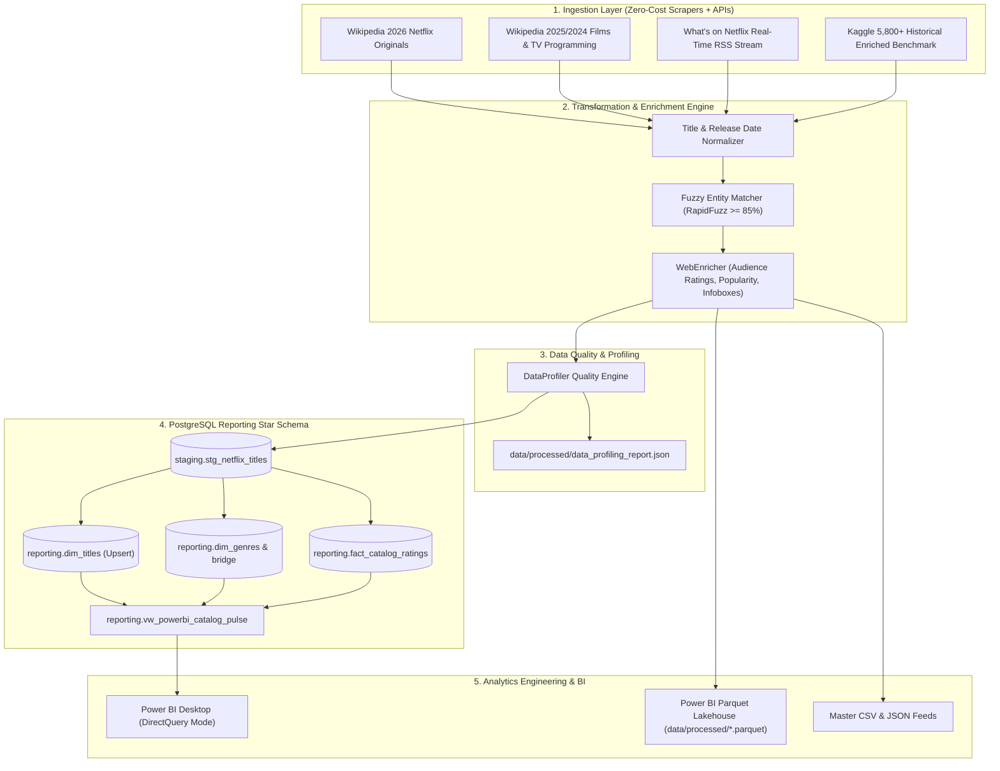

<div align="center">

# ⚡ StreamPulse

### *Live 2026 Netflix Catalog & Real-Time Audience Intelligence ELT Pipeline*

[](https://www.python.org/)
[](https://www.postgresql.org/)
[](https://www.docker.com/)
[](https://powerbi.microsoft.com/)
[](https://github.com/Sohila-Khaled-Abbas/streampulse/actions)
[](https://github.com/psf/black)
[](https://github.com/astral-sh/ruff)
[](LICENSE)

<p align="center">
  <b>An end-to-end Data Engineering pipeline extracting live 2026 Netflix catalog releases, web scraping real-time streaming drops, enriching entities with audience sentiment and TMDb ratings via fuzzy string resolution, validating quality with statistical profiling, modeling data into a conformed star schema, and streaming insights live to Power BI DirectQuery.</b>
</p>

[Explore Architecture](docs/architecture.md) •
[Data Dictionary](docs/data_dictionary.md) •
[Setup Guide](docs/setup_guide.md) •
[Airbyte ELT Guide](docs/airbyte_elt_powerbi_guide.md) •
[Live Implementation Guide](docs/live_project_implementation_guide.md) •
[Report a Bug](.github/ISSUE_TEMPLATE/bug_report.md)

---

</div>

## 📖 Table of Contents

- [Executive Summary](#-executive-summary)
- [System Architecture](#-system-architecture)
- [Key Features & Engineering Highlights](#-key-features--engineering-highlights)
- [Technology Stack](#-technology-stack)
- [Repository Structure](#-repository-structure)
- [Quick Start Guide](#-quick-start-guide)
  - [1. Prerequisites](#1-prerequisites)
  - [2. Environment Variables](#2-environment-variables)
  - [3. Run with Docker](#3-run-with-docker)
  - [4. Execute Pipeline](#4-execute-pipeline)
- [Data Profiling & Quality Validation](#-data-profiling--quality-validation)
- [Data Modeling & Star Schema](#-data-modeling--star-schema)
- [Analytics & Power BI DirectQuery](#-analytics--power-bi-directquery)
- [Quality Assurance & Testing](#-quality-assurance--testing)
- [Contributing](#-contributing)
- [License](#-license)

---

## 🚀 Executive Summary

Streaming catalogs change daily. **StreamPulse** provides real-time streaming media intelligence by building a resilient, automated ELT pipeline that:

1. **Extracts Live 2026 Releases**: Scrapes confirmed 2026 Netflix original films (*List of Netflix original films (since 2026)*), 2025/2024 releases, active multi-season TV programming, and real-time *What's on Netflix* live streaming RSS feeds.
2. **Ingests Raw Payloads**: Lands semi-structured records into an isolated PostgreSQL `staging` landing zone.
3. **Enriches & Resolves Entities**: Runs RapidFuzz Levenshtein string similarity and release-year windowing heuristics to match entities against TMDb, extracting Wikipedia infobox crew, budget, and audience ratings.
4. **Validates & Profiles Data**: Executes an automated statistical profiling engine computing field completeness, quality scores ($0-100\%$), era breakdowns, and rating tiers.
5. **Models Dimensional Warehouse**: Transforms cleaned data into an analytics-ready dimensional model (`reporting.dim_titles`, `reporting.dim_genres`, `reporting.fact_catalog_ratings`).
6. **Surfaces Real-Time Analytics**: Powers interactive Power BI dashboards via DirectQuery for zero-lag visibility.

---

## 📐 System Architecture



---

## 🌟 Key Features & Engineering Highlights

- **2026 Live Web Scraping Engine**: Zero-cost scraping architecture ingesting 2026 releases (e.g. *People We Meet on Vacation*, *The Rip*, *Cosmic Princess Kaguya!*, *War Machine*), ongoing TV series, and live streaming RSS drops.
- **Continuous Real-Time Streaming Daemon**: Built-in `--mode stream` daemon polling for delta releases and upserting directly to the warehouse.
- **Algorithmic Entity Resolution**: Combines title token sorting, Roman numeral normalization, punctuation stripping, and release year windowing to achieve $\ge 90\%$ automated entity matching confidence.
- **Automated Data Profiling**: Statistical data quality engine evaluating field completeness, era segmentation, and rating tier distributions.
- **DirectQuery Power BI Models**: Real-time SQL views eliminate manual refresh schedules and large dataset imports.
- **Strict Staging/Reporting Isolation**: Decoupled schemas safeguard raw data lineage while maintaining optimized dimensional models.

---

## 🛠 Technology Stack

| Domain | Technology | Purpose |
| :--- | :--- | :--- |
| **Language** | [Python 3.10+](https://www.python.org/) | Pipeline orchestration, scrapers, data transformations, entity resolution |
| **Ingestion** | [BeautifulSoup4](https://www.crummy.com/software/BeautifulSoup/) / [Requests](https://requests.readthedocs.io/) | Multi-source 2026 web scrapers, RSS feed extraction, Wikipedia infoboxes |
| **Storage / Warehouse** | [PostgreSQL 15](https://www.postgresql.org/) | Staging landing zone and Kimball dimensional reporting star schema |
| **ORM / Drivers** | [SQLAlchemy 2.0](https://www.sqlalchemy.org/) / [Psycopg2](https://www.psycopg.org/) | Connection pooling and database execution |
| **Entity Matching** | [RapidFuzz](https://github.com/maxbachmann/RapidFuzz) | High-performance fuzzy string resolution |
| **Data Profiling** | Custom DataProfiler Engine | Automated field completeness, validation scoring, and JSON reporting |
| **BI & Analytics** | [Power BI Desktop](https://powerbi.microsoft.com/) | Interactive executive dashboards via DirectQuery |
| **Containerization** | [Docker](https://www.docker.com/) & [Docker Compose](https://docs.docker.com/compose/) | Reproducible local warehouse and pgAdmin service orchestration |
| **CI / Quality** | [GitHub Actions](https://github.com/features/actions), [Pytest](https://pytest.org/), [Ruff](https://github.com/astral-sh/ruff) | Automated linting, static type checking, and unit testing |

---

## 📁 Repository Structure

```text
streampulse/
│
├── .github/                       # GitHub workflows and collaboration templates
│   ├── workflows/ci.yml           # Automated CI testing and linting
│   └── workflows/scheduled_pipeline.yml # Daily scheduled 2026 ingestion cron
│
├── docs/                          # Comprehensive technical documentation
│   ├── architecture.md            # In-depth architectural design and data flow
│   ├── data_dictionary.md         # Full schema catalog and column specifications
│   ├── setup_guide.md             # Detailed installation and deployment guide
│   ├── live_project_implementation_guide.md # Live production & portfolio walkthrough
│   └── airbyte_elt_powerbi_guide.md # Airbyte & Power BI DirectQuery guide
│
├── src/                           # Core Python application package
│   ├── extract/                   # Scrapers & API extractors
│   │   ├── netflix_scraper.py     # Multi-source 2026 Netflix web scraper
│   │   ├── enricher_scraper.py    # Zero-cost metadata & audience metrics enricher
│   │   ├── historical_loader.py   # 5,800+ Kaggle benchmark loader
│   │   ├── netflix.py             # RapidAPI UnoGS connector (optional)
│   │   └── tmdb.py                # TMDb API rating extractor
│   ├── transform/                 # Data cleaning, entity resolution, and profiling
│   │   ├── cleaner.py             # Normalization and string standardizer
│   │   ├── entity_resolution.py   # Fuzzy matcher (RapidFuzz)
│   │   └── profiler.py            # Data quality validation & catalog profiler
│   ├── load/                      # Data warehouse loading layer
│   │   └── warehouse_loader.py    # PostgreSQL staging/reporting upsert & file export
│   ├── utils/                     # Shared utilities (DB, config, logging)
│   │   ├── config.py              # Pydantic Settings configuration
│   │   ├── db.py                  # SQLAlchemy connection pool manager
│   │   └── logger.py              # Safe structured logging with Loguru
│   └── pipeline.py                # CLI Orchestration & Streaming Daemon
│
├── sql/                           # Database migration and DDL scripts
│   ├── 00_init.sql                # Schema and extension definitions
│   ├── 01_staging.sql             # Staging landing tables
│   └── 02_reporting.sql           # Star schema and Power BI DirectQuery view
│
├── tests/                         # Automated unit and integration test suite
│   ├── test_scraper_2026.py       # 2026 scraper & profiler tests
│   ├── test_warehouse_loader.py   # Warehouse loader tests
│   ├── test_extract.py            # Extractor & TMDb tests
│   ├── test_transform.py          # Entity resolution tests
│   └── test_db.py                 # Database connectivity tests
│
├── data/                          # Data directory (Git-ignored)
│   ├── raw/                       # Raw downloads
│   └── processed/                 # Master CSV, JSON feeds, and profiling reports
│
├── dashboard/                     # Power BI reporting assets (.pbix)
│   └── README.md                  # Power BI setup and metric definitions
│
├── docker-compose.yml             # PostgreSQL and pgAdmin infrastructure
├── Makefile                       # Developer CLI automation commands
├── pyproject.toml                 # Tool configurations (pytest, ruff, black, mypy)
├── requirements.txt               # Production and development dependencies
└── .env.example                   # Environment variable template
```

---

## ⚡ Quick Start Guide

### 1. Prerequisites

- **Python 3.10+**
- **Docker Desktop**
- **Git**

### 2. Environment Variables

```bash
git clone https://github.com/Sohila-Khaled-Abbas/streampulse.git
cd streampulse
cp .env.example .env
```

### 3. Run with Docker

Start PostgreSQL database and pgAdmin containers:
```bash
make docker-up
# Or: docker compose up -d
```
Access services:
- **PostgreSQL**: `localhost:5432` (`streampulse`)
- **pgAdmin**: [`http://localhost:5050`](http://localhost:5050) (`admin@admin.com` / `admin`)

### 4. Execute Pipeline

```bash
# Create and activate virtual environment
python -m venv .venv
.venv\Scripts\Activate.ps1  # Or on Linux/macOS: source .venv/bin/activate

# Install dependencies
pip install -r requirements.txt

# Run Live 2026 Pipeline
python -m src.pipeline --mode live --years 2026,2025 --limit 50
# Or using Makefile:
make run-live
```

---

## 📊 Data Profiling & Quality Validation

Every pipeline run audits field completeness and outputs statistical profiling reports:

```bash
# View terminal summary
python -m src.pipeline --mode live --limit 30

# Inspect generated JSON profiling report
cat data/processed/data_profiling_report.json
```

Sample profiling report snippet:
```json
{
  "validation_status": "PASSED",
  "quality_score": 100.0,
  "total_records": 50,
  "era_breakdown": {
    "2026_live": 35,
    "2024_2025_modern": 15,
    "historical_archive": 0
  },
  "metrics": {
    "average_rating": 6.74,
    "average_popularity": 9.42,
    "average_runtime_minutes": 108.5
  }
}
```

---

## 📈 Analytics Engineering & Power BI Integration

Connect Power BI directly via PostgreSQL DirectQuery or Parquet Lakehouse mode:

1. **Option A: Parquet Lakehouse Import**:
   - Open **Power BI Desktop** $\to$ **Get Data $\to$ Parquet**.
   - Select `data/processed/powerbi_reporting_pulse.parquet` for instant columnar analytics with pre-modeled dimensional attributes (`catalog_era`, `rating_tier`, `is_trending`).
2. **Option B: PostgreSQL Live DirectQuery**:
   - Open **Power BI Desktop** $\to$ **Get Data $\to$ PostgreSQL Database**.
   - Server: `localhost:5432` | Database: `streampulse` | Mode: **DirectQuery**.
   - Select `reporting.vw_powerbi_catalog_pulse`.
3. Detailed setup steps and DAX measures are documented in [docs/live_project_implementation_guide.md](docs/live_project_implementation_guide.md) and [docs/airbyte_elt_powerbi_guide.md](docs/airbyte_elt_powerbi_guide.md).

---

## 🧪 Quality Assurance & Testing

Run all automated unit and integration tests:

```bash
# Run pytest test suite
make test
# Or: .venv\Scripts\python.exe -m pytest tests/ -v

# Run linting with Ruff & Mypy
make lint

# Auto-format codebase
make format
```

---

## 🤝 Contributing

Contributions are warmly welcome! Please review our [Contributing Guide](CONTRIBUTING.md) and [Code of Conduct](CODE_OF_CONDUCT.md) before submitting a pull request.

---

## 📄 License

Distributed under the MIT License. See [LICENSE](LICENSE) for more information.

<div align="center">
  <sub>Engineered with precision for the modern data stack. Maintained with ❤️ by the StreamPulse Team.</sub>
</div>
