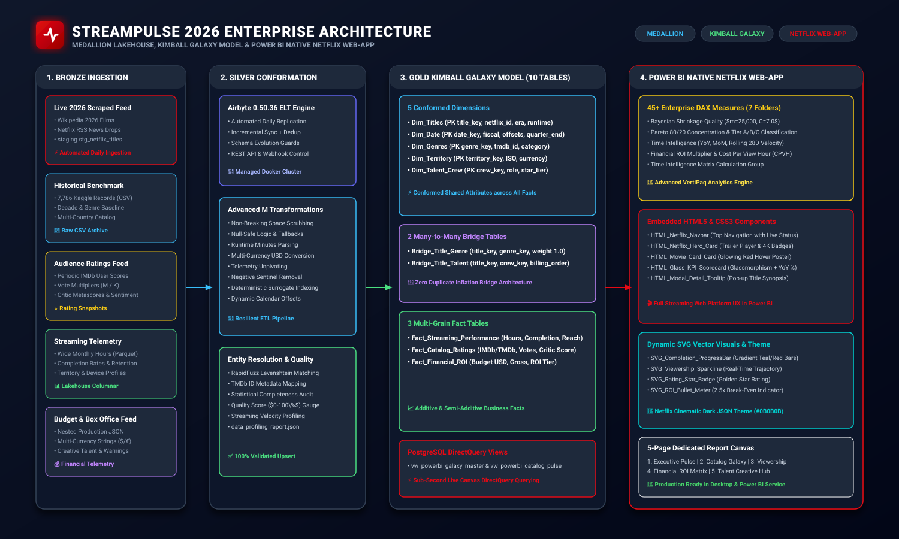
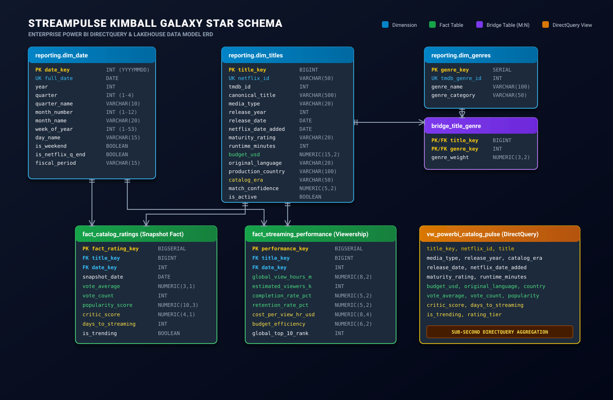

<div align="center">

# ⚡ StreamPulse

### *Live 2026 Streaming Intelligence, Kimball Galaxy Lakehouse & Power BI Analytics Platform*

[](https://www.python.org/)
[](https://www.postgresql.org/)
[](https://airbyte.com/)
[](https://www.docker.com/)
[](https://powerbi.microsoft.com/)
[](LICENSE)

<p align="center">
  <b>An enterprise-grade Data Engineering &amp; Analytics Engineering platform extracting live 2026 Netflix catalog releases, web scraping real-time streaming drops, enriching entities with audience sentiment and TMDb ratings via fuzzy string resolution, orchestrating daily replication via Airbyte into a PostgreSQL Kimball Galaxy Star Schema, and delivering a native Netflix-style streaming web application experience directly inside Power BI.</b>
</p>

[📊 Power BI Masterclass Guide](docs/powerbi_analytics_engineering_guide.md) •
[🔄 Airbyte ELT Guide](docs/airbyte_elt_powerbi_guide.md) •
[📐 Architecture Deep Dive](docs/architecture.md) •
[📖 Data Dictionary](docs/data_dictionary.md) •
[🚀 Setup Guide](docs/setup_guide.md) •
[🎯 Live Implementation Guide](docs/live_project_implementation_guide.md)

---

</div>

## 🖼️ High-Resolution Architecture & Data Model

<div align="center">
  <h3>System Architecture Diagram</h3>
  

  <br/>

  <h3>Kimball Galaxy Constellation Schema &amp; ERD</h3>
  
</div>

---

## 📖 Table of Contents

- [Executive Summary](#-executive-summary)
- [System Architecture & Medallion Pipeline](#-system-architecture--medallion-pipeline)
- [Kimball Galaxy Constellation Data Model](#-kimball-galaxy-constellation-data-model)
- [Native Netflix Web-App Experience in Power BI](#-native-netflix-web-app-experience-in-power-bi)
- [Multi-Source Data Ingestion & Power Query (M Language)](#-multi-source-data-ingestion--power-query-m-language)
- [45+ Enterprise DAX Measures & Calculation Groups](#-45-enterprise-dax-measures--calculation-groups)
- [Airbyte Automated Daily ELT Pipeline](#-airbyte-automated-daily-elt-pipeline)
- [Quick Start Guide](#-quick-start-guide)
- [License](#-license)

---

## 🚀 Executive Summary

Streaming entertainment platforms release hundreds of original titles every month. **StreamPulse** provides streaming media intelligence through a resilient, automated ELT pipeline that:

1. **Extracts Live 2026 Releases**: Scrapes confirmed 2026 Netflix original films, 2025/2024 releases, active multi-season TV programming, and real-time *What's on Netflix* live streaming RSS feeds.
2. **Replicates via Airbyte**: Ingests multi-source payloads into an isolated PostgreSQL `staging` landing zone.
3. **Enriches & Resolves Entities**: Runs RapidFuzz Levenshtein string similarity and release-year windowing heuristics to match entities against TMDb, extracting Wikipedia infobox crew, budget, and audience ratings.
4. **Validates & Profiles Data**: Executes an automated statistical profiling engine computing field completeness, quality scores ($0-100\%$), era breakdowns, and rating tiers.
5. **Models Dimensional Galaxy Warehouse**: Transforms cleaned data into a 10-table Kimball Galaxy Model (`Dim_Titles`, `Dim_Date`, `Dim_Genres`, `Dim_Territory`, `Dim_Talent_Crew`, `Bridge_Title_Genre`, `Bridge_Title_Talent`, `Fact_Streaming_Performance`, `Fact_Catalog_Ratings`, `Fact_Financial_ROI`).
6. **Delivers Native Netflix Web-App in Power BI**: Generates dynamic HTML5/CSS3 components, SVG progress bars/sparklines, and 45+ DAX business measures for an app-like experience inside Power BI Desktop and Power BI Service.

---

## 🏛️ Kimball Galaxy Constellation Data Model

```
                                    +-----------------------+
                                    |     Dim_Territory     |
                                    +-----------------------+
                                                | 1
                                                | *
+--------------------+ 1            * +---------------------------+ *            1 +-------------------+
|     Dim_Genres     | <------------- |     Bridge_Title_Genre    | -------------> |     Dim_Titles    |
+--------------------+                +---------------------------+                +-------------------+
                                                                                     | 1   | 1       | 1
       +-----------------------------------------------------------------------------+     |         +------------------+
       | *                                                                                 | *                          | *
+-----------------------------+               +--------------------------+  1            * |                   +--------------------+
| Fact_Streaming_Performance  |               |      Dim_Talent_Crew     | <---------------+                   | Fact_Financial_ROI |
+-----------------------------+               +--------------------------+                                     +--------------------+
       | *                                                 | 1                                                          | *
       |                                                   | *                                                          |
       |                              +---------------------------+                                                     |
       |                              |    Bridge_Title_Talent    |                                                     |
       |                              +---------------------------+                                                     |
       | *                                                                                                              | *
+--------------------+ 1                                                                                                |
|      Dim_Date      | <------------------------------------------------------------------------------------------------+
+--------------------+ 1
       |
       | *
+-----------------------------+
|    Fact_Catalog_Ratings     |
+-----------------------------+
```

---

## 🎬 Native Netflix Web-App Experience in Power BI

The Power BI report functions as a **modern streaming platform web application** powered by:
- **Embedded HTML/CSS Components**: Top sticky navbar with active tabs, featured hero video trailer card with 4K/5.1 audio badges, and movie poster carousels with glowing red hover effects.
- **Dynamic SVG Vector Measures**: Inline progress bars, multi-point viewership sparklines, golden rating star badges, and radial ROI bullet meters.
- **Netflix Cinematic Dark JSON Theme**: Deep black (`#0B0B0B`), Obsidian (`#141414`), Netflix Red (`#E50914`), and Neon Cyan (`#00D2D2`).
- **5-Page Web Layout**: Executive Pulse, Catalog Galaxy, Viewership Telemetry, Financial ROI Matrix, and Talent Creative Hub.

---

## 🧩 Multi-Source Data Ingestion & Power Query (M Language)

StreamPulse cleans and conforms **5 disparate sources** directly in Power Query using advanced M code:
1. `stg_netflix_titles` (PostgreSQL live staging)
2. `netflix_enriched_historical.csv` (7,786 Kaggle benchmark records)
3. `imdb_external_ratings.csv` (Periodic snapshot ratings, vote count multipliers)
4. `streaming_viewership_wide.parquet` (Columnar telemetry unpivoting, sentinel cleansing)
5. `boxoffice_budget_feed.json` (Multi-currency budget & gross parsing, content warnings)

> 📘 *See all copy-paste M queries in [`docs/powerbi_analytics_engineering_guide.md`](docs/powerbi_analytics_engineering_guide.md).*

---

## 📊 45+ Enterprise DAX Measures & Calculation Groups

Organized into 7 clean display folders:
- **01. Core Streaming KPIs**: `Total_Catalog_Titles`, `Total_View_Hours_Formatted`, `Avg_Completion_Rate_Pct`.
- **02. Time Intelligence**: `View_Hours_YTD`, `View_Hours_YoY_Pct`, `Rolling_28D_View_Hours`.
- **03. Advanced Analytics & Pareto**: `Pareto_Cumulative_Pct`, `Pareto_Catalog_Tier`, `Top_10_Concentration_Share_Pct`.
- **04. Bayesian Quality Scoring**: `Bayesian_Weighted_Score` ($m=25,000, C=7.0$), `Critic_Audience_Gap`.
- **05. Financial ROI & Unit Economics**: `Total_Worldwide_Gross_M`, `Financial_ROI_Multiplier`, `Cost_Per_View_Hour_USD`.
- **06. Dynamic SVG Visuals**: `SVG_Completion_ProgressBar`, `SVG_Viewership_Sparkline`, `SVG_Rating_Star_Badge`.
- **07. HTML/CSS Web Components**: `HTML_Netflix_Navbar`, `HTML_Netflix_Hero_Card`, `HTML_Movie_Card_Card`.

---

## ⚡ Quick Start Guide

```powershell
# 1. Clone repo & setup virtual environment
git clone https://github.com/Sohila-Khaled-Abbas/streampulse.git
cd streampulse

python -m venv .venv
.\.venv\Scripts\Activate.ps1
pip install -e .

# 2. Start PostgreSQL & Airbyte Docker Containers
docker compose up -d
docker compose -f docker/docker-compose.airbyte.yml up -d

# 3. Open Power BI Desktop & follow the Masterclass Guide
# docs/powerbi_analytics_engineering_guide.md
```

---

## 📄 License
This project is licensed under the [MIT License](LICENSE).
