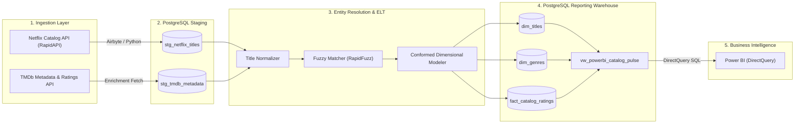

<div align="center">

# ⚡ StreamPulse
### *Live Netflix Catalog & Audience Intelligence ELT Pipeline*

[](https://www.python.org/)
[](https://www.postgresql.org/)
[](https://www.docker.com/)
[](https://airbyte.com/)
[](https://powerbi.microsoft.com/)
[](https://github.com/)
[](https://github.com/psf/black)
[](https://github.com/astral-sh/ruff)
[](LICENSE)

<p align="center">
  <b>An end-to-end Data Engineering pipeline extracting live Netflix catalog updates, enriching them with TMDb audience popularity and ratings via fuzzy entity resolution, modeling data into a conformed star schema, and streaming insights live to Power BI DirectQuery.</b>
</p>

[Explore Architecture](docs/architecture.md) •
[Data Dictionary](docs/data_dictionary.md) •
[Setup Guide](docs/setup_guide.md) •
[Live Implementation Guide](docs/live_project_implementation_guide.md) •
[Report a Bug](.github/ISSUE_TEMPLATE/bug_report.md)

---

</div>

## 📖 Table of Contents

- [Executive Summary](#-executive-summary)
- [System Architecture](#-system-architecture)
- [Key Features & Engineering Highlights](#-key-features--engineering-highlights)
- [Technology Stack](#-technology-stack)
- [Repository Structure](#-repository-structure)
- [Quick Start Guide](#-quick-start-guide)
  - [1. Prerequisites](#1-prerequisites)
  - [2. Environment Variables](#2-environment-variables)
  - [3. Run with Docker](#3-run-with-docker)
  - [4. Execute Pipeline](#4-execute-pipeline)
- [Data Modeling & Schemas](#-data-modeling--schemas)
- [Analytics & Power BI DirectQuery](#-analytics--power-bi-directquery)
- [Quality Assurance & CI/CD](#-quality-assurance--cicd)
- [Contributing](#-contributing)
- [License](#-license)

---

## 🚀 Executive Summary

Streaming catalogs change daily. **StreamPulse** provides streaming media intelligence by building a resilient, automated ELT pipeline that:
1. **Extracts** live additions and changes from the Netflix global catalog (via RapidAPI / UnoGS).
2. **Ingests** raw semi-structured payloads into an isolated PostgreSQL `staging` schema.
3. **Enriches & Resolves Entities** by querying The Movie Database (TMDb) API and running Levenshtein string similarity and year-heuristic algorithms to connect disparate entities.
4. **Transforms & Models** cleaned data into an analytics-ready dimensional model (`reporting` star schema).
5. **Surfaces Real-Time Analytics** directly to Power BI using DirectQuery to ensure zero-lag dashboard refreshes.

---

## 📐 System Architecture



---

## 🌟 Key Features & Engineering Highlights

- **Algorithmic Entity Resolution**: Combines title token sorting, Roman numeral normalization, punctuation stripping, and release year windowing to achieve $\ge 90\%$ automated entity matching confidence across streaming sources.
- **Strict Staging/Reporting Isolation**: Decoupled schemas safeguard raw data lineage while maintaining optimized, indexed relational models for low-latency BI queries.
- **DirectQuery Power BI Models**: Real-time SQL views eliminate manual refresh schedules and large dataset imports.
- **Production-Grade Tooling**: Typed configuration using Pydantic Settings, centralized structured logging with Loguru, full Docker containerization, and automated CI pipelines with GitHub Actions.

---

## 🛠 Technology Stack

| Domain | Technology | Purpose |
| :--- | :--- | :--- |
| **Language** | [Python 3.10+](https://www.python.org/) | Pipeline orchestration, data transformations, entity resolution |
| **Ingestion** | [Airbyte](https://airbyte.com/) / [Requests](https://requests.readthedocs.io/) | API extraction from RapidAPI and TMDb |
| **Storage / Warehouse** | [PostgreSQL 15](https://www.postgresql.org/) | Staging landing zone and dimensional reporting data store |
| **ORM / Drivers** | [SQLAlchemy 2.0](https://www.sqlalchemy.org/) / [Psycopg2](https://www.psycopg.org/) | Connection pooling and database execution |
| **Entity Matching** | [RapidFuzz](https://github.com/maxbachmann/RapidFuzz) / [Levenshtein](https://github.com/maxbachmann/Levenshtein) | High-performance fuzzy string resolution |
| **Data Modeling** | PostgreSQL DDL & Views | Star schema modeling (`dim_titles`, `fact_catalog_ratings`) |
| **BI & Analytics** | [Power BI Desktop](https://powerbi.microsoft.com/) | Interactive executive dashboards via DirectQuery |
| **Containerization** | [Docker](https://www.docker.com/) & [Docker Compose](https://docs.docker.com/compose/) | Reproducible local warehouse and pgAdmin service orchestration |
| **CI / Quality** | [GitHub Actions](https://github.com/features/actions), [Pytest](https://pytest.org/), [Ruff](https://github.com/astral-sh/ruff) | Automated linting, static type checking, and unit testing |

---

## 📁 Repository Structure

```text
streampulse/
│
├── .github/                       # GitHub workflows and collaboration templates
│   ├── workflows/ci.yml           # Automated CI testing and linting
│   ├── ISSUE_TEMPLATE/            # Bug report and feature request templates
│   └── PULL_REQUEST_TEMPLATE.md   # Standardized PR review checklist
│
├── docs/                          # Comprehensive technical documentation
│   ├── architecture.md            # In-depth architectural design and data flow
│   ├── data_dictionary.md         # Full schema catalog and column specifications
│   └── setup_guide.md             # Detailed installation and deployment guide
│
├── src/                           # Core Python application package
│   ├── extract/                   # API extractors (Netflix and TMDb)
│   │   ├── netflix.py
│   │   └── tmdb.py
│   ├── transform/                 # Data cleaning and fuzzy entity resolution
│   │   ├── cleaner.py
│   │   └── entity_resolution.py
│   ├── utils/                     # Shared utilities (DB, config, logging)
│   │   ├── config.py
│   │   ├── db.py
│   │   └── logger.py
│   └── pipeline.py                # Main orchestration runner
│
├── sql/                           # Database migration and DDL scripts
│   ├── 00_init.sql                # Schema and extension definitions
│   ├── 01_staging.sql             # Staging landing tables
│   └── 02_reporting.sql           # Dimensional model and Power BI views
│
├── tests/                         # Automated unit and integration test suite
│   ├── test_extract.py
│   ├── test_transform.py
│   └── test_db.py
│
├── data/                          # Data directory (Git-ignored)
│   ├── raw/                       # Raw API extracts
│   └── processed/                 # Intermediate files
│
├── dashboard/                     # Power BI reporting assets (.pbix)
│   └── README.md                  # Power BI setup and metric definitions
│
├── docker-compose.yml             # PostgreSQL and pgAdmin infrastructure
├── Makefile                       # Developer CLI automation commands
├── pyproject.toml                 # Tool configurations (pytest, ruff, black, mypy)
├── requirements.txt               # Production and development dependencies
├── .env.example                   # Environment variable template
├── .gitignore                     # Git exclusion rules
├── LICENSE                        # MIT License
├── CONTRIBUTING.md                # Contribution guidelines
├── CODE_OF_CONDUCT.md             # Contributor covenant code of conduct
└── SECURITY.md                    # Vulnerability reporting policy
```

---

## ⚡ Quick Start Guide

### 1. Prerequisites
- **Python 3.10+**
- **Docker Desktop**
- **Git**

### 2. Environment Variables
Clone the repository and copy the environment template:
```bash
git clone https://github.com/your-username/streampulse.git
cd streampulse
cp .env.example .env
```
Configure your `.env` with your API keys and credentials:
```env
RAPIDAPI_KEY=your_rapidapi_key_here
TMDB_API_KEY=your_tmdb_api_key_here
DB_USER=postgres
DB_PASSWORD=postgres
DB_NAME=streampulse
DB_HOST=localhost
DB_PORT=5432
```

### 3. Run with Docker
Start the PostgreSQL database and pgAdmin containers:
```bash
make docker-up
# Or: docker compose up -d
```

### 4. Execute Pipeline
Install dependencies and run the end-to-end ELT pipeline:
```bash
# Create and activate virtual environment
python -m venv .venv
source .venv/bin/activate  # Or on Windows: .venv\Scripts\Activate.ps1

# Install dependencies
pip install -r requirements.txt

# Run the pipeline
python -m src.pipeline
```

---

## 📊 Data Modeling & Schemas

StreamPulse implements a Kimball-style dimensional star schema:

```text
       ┌────────────────────────┐
       │   reporting.dim_genres │
       └───────────┬────────────┘
                   │ 1:N
       ┌───────────┴────────────┐
       │  bridge_title_genre    │
       └───────────┬────────────┘
                   │ N:1
       ┌───────────┴────────────┐          1:N         ┌─────────────────────────────────┐
       │  reporting.dim_titles  ├──────────────────────┤ reporting.fact_catalog_ratings  │
       └────────────────────────┘                      └─────────────────────────────────┘
```

Detailed definitions and constraints are available in the [Data Dictionary](docs/data_dictionary.md).

---

## 📈 Analytics & Power BI DirectQuery

Connect Power BI directly to the reporting view for real-time catalog metrics:
1. Open **Power BI Desktop** $\to$ **Get Data** $\to$ **PostgreSQL Database**.
2. Server: `localhost:5432` | Database: `streampulse` | Mode: **DirectQuery**.
3. Select `reporting.vw_powerbi_catalog_pulse`.
4. Detailed setup steps and DAX measures are documented in [dashboard/README.md](dashboard/README.md).

---

## 🧪 Quality Assurance & CI/CD

Run test suites, formatting, and linting locally:

```bash
# Run unit tests with code coverage
make test
# Or: pytest

# Run linting with Ruff & Mypy
make lint

# Auto-format codebase
make format
```

Automated GitHub Actions validate all pull requests against Python 3.10, 3.11, and 3.12 matrices.

---

## 🤝 Contributing

Contributions are warmly welcome! Please review our [Contributing Guide](CONTRIBUTING.md) and [Code of Conduct](CODE_OF_CONDUCT.md) before submitting a pull request.

---

## 📄 License

Distributed under the MIT License. See [LICENSE](LICENSE) for more information.

---

<div align="center">
  <sub>Engineered with precision for the modern data stack. Maintained with ❤️ by the StreamPulse Team.</sub>
</div>
