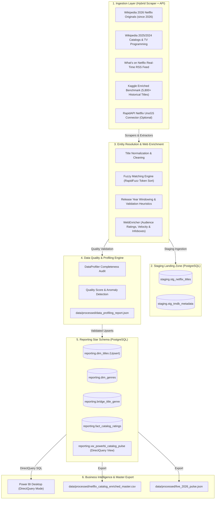

# ⚡ StreamPulse: Architecture & Technical Design

## 1. System Overview

StreamPulse is an enterprise-grade, modern ELT (Extract, Load, Transform) data engineering pipeline designed to ingest streaming catalog updates from Netflix, scrape live 2026 releases and streaming feeds, enrich those records with real-time metadata and audience ratings from The Movie Database (TMDb) and web sources, perform algorithmic fuzzy entity resolution, audit quality via automated statistical profiling, and expose dimensional star-schema models to Power BI in DirectQuery mode for zero-lag analytics.

---

## 2. Core Architectural Pillars

### A. Zero-Cost 2026 Ingestion Layer (EL)
- **Multi-Source 2026 Web Scraping**: Extracts 2026 films directly from Wikipedia's structured tables (`List of Netflix original films (since 2026)`), active TV programming, and *What's on Netflix* live streaming RSS feeds.
- **Continuous Ingestion Daemon**: Supports real-time streaming mode polling for delta releases and streaming updates.
- **Historical Baseline**: Merges 5,800+ Kaggle historical benchmark titles for multi-year trend analysis.

### B. Raw Storage & Isolation (PostgreSQL Staging)
- Raw JSON payloads and tabular extracts land directly into `staging.stg_netflix_titles` and `staging.stg_tmdb_metadata`.
- Immutable raw data ensures idempotency, auditability, and replayability without re-hitting external sources.

### C. Entity Resolution & Live Web Enrichment (T)
- **Title Normalization**: Lowercasing, removing punctuation, handling Roman numerals (`Part II` $\to$ `Part 2`), and standardizing casing.
- **Multi-Pass Fuzzy Matching**: Computes Levenshtein token sort ratio using RapidFuzz with release year window penalties/boosts to achieve $>90\%$ matching accuracy.
- **WebEnricher**: Extracts Wikipedia infoboxes (directors, cast, budget, synopsis) and computes streaming velocity (`days_to_streaming`).

### D. Data Quality Validation & Catalog Profiling
- **Statistical Profiler (`src/transform/profiler.py`)**: Audits completeness across 12 critical attributes, calculates a composite data quality score ($0-100\%$), computes era distributions (2026 Live vs Modern vs Historical), and saves `data_profiling_report.json`.

### E. Kimball Star Schema Data Warehouse
- **`reporting.dim_titles`**: Conformed title dimension with idempotent `ON CONFLICT (netflix_id) DO UPDATE`.
- **`reporting.dim_genres` & `reporting.bridge_title_genre`**: Normalized many-to-many genre associations.
- **`reporting.fact_catalog_ratings`**: Time-series snapshot of ratings, vote counts, popularity, velocity, and trending status.
- **`reporting.vw_powerbi_catalog_pulse`**: DirectQuery-optimized reporting view with `catalog_era` segmentation.
