# ⚡ StreamPulse: Enterprise Architecture & Platform Technical Design

## 1. System Overview

StreamPulse is an enterprise-grade streaming analytics and data intelligence platform. It ingests multi-source streaming telemetry, scraped 2026 releases, external audience ratings, production budget feeds, and historical benchmarks into a **Medallion Data Lakehouse & Kimball Galaxy Star Schema Data Warehouse**, exposing high-performance reporting views and native HTML/CSS streaming web applications inside **Power BI**.

```mermaid
flowchart TD
    subgraph Sources["1. Bronze Ingestion Layer (Disparate Multi-Source Feeds)"]
        A1["PostgreSQL Staging (stg_netflix_titles)"]
        A2["Historical Catalog Archive (7,786 Kaggle Records CSV)"]
        A3["Live External IMDb / TMDb Ratings Snapshots (CSV)"]
        A4["Streaming Viewership Telemetry (Wide Parquet)"]
        A5["Production Budget & Box Office Feed (Nested JSON)"]
    end

    subgraph Silver["2. Silver Processing & Conformed Modeling (ETL / Power Query M)"]
        B1["Text Scrubbing & Non-Breaking Space Sanitization"]
        B2["Multi-Currency Budget & Gross Parsing ($/€/M/k)"]
        B3["Time-Series Telemetry Unpivoting & Sentinel Cleansing"]
        B4["Surrogate Key Generation & Conformed Dimensions"]
    end

    subgraph Gold["3. Gold Kimball Galaxy Star Schema (Semantic Model / PostgreSQL)"]
        C1[("Dim_Titles")]
        C2[("Dim_Date")]
        C3[("Dim_Genres")]
        C4[("Dim_Territory")]
        C5[("Dim_Talent_Crew")]
        C6[("Bridge_Title_Genre")]
        C7[("Bridge_Title_Talent")]
        C8[("Fact_Streaming_Performance")]
        C9[("Fact_Catalog_Ratings")]
        C10[("Fact_Financial_ROI")]
    end

    subgraph PowerBI["4. Power BI Native Web-App & Semantic Layer"]
        D1["45+ Enterprise DAX Measures (7 Display Folders)"]
        D2["Calculation Groups (Time Intelligence Matrix)"]
        D3["Dynamic SVG Visuals (Sparklines, Progress Bars, Badges)"]
        D4["Native HTML5 / CSS3 Netflix Web UI Components"]
        D5["5-Page Netflix Streaming App Report Layout"]
    end

    Sources --> Silver
    Silver --> Gold
    Gold --> PowerBI
```

---

## 2. Medallion Architecture Specification

### 🥉 Bronze Layer: Raw Ingestion
- **PostgreSQL Live Staging**: Captures real-time 2026/2025 scraped releases via `staging.stg_netflix_titles`.
- **Historical Catalog CSV**: Baseline benchmark of 7,786 titles with metadata, release decades, and country origins.
- **Audience Ratings CSV**: Periodic snapshot of user scores, vote counts, and review sentiments.
- **Viewership Telemetry Parquet**: High-volume, wide columnar telemetry records across monthly streaming metrics.
- **Production Budget JSON**: Complex hierarchical JSON with nested talent, content warnings, and multi-currency financials.

### 🥈 Silver Layer: Cleaning, Normalization & Enrichment
- **Power Query (M Language)** and Python transformation pipelines scrub string anomalies (`\xa0`, HTML entities), parse multi-currency strings into clean float numbers, unpivot wide monthly telemetry into vertical facts, and map conformed dimension keys.
- Implements resilient error handling (`try-otherwise`) and deterministic surrogate indexing.

### 🥇 Gold Layer: Kimball Galaxy Constellation Model
- **Conformed Dimensions**: `Dim_Titles`, `Dim_Date`, `Dim_Genres`, `Dim_Territory`, `Dim_Talent_Crew`.
- **Bridge Tables**: `Bridge_Title_Genre`, `Bridge_Title_Talent` with explicit fractional weighting (`1.00`).
- **Multi-Grain Facts**:
  - `Fact_Streaming_Performance`: Monthly grain by title, territory, and device.
  - `Fact_Catalog_Ratings`: Periodic snapshot grain by title and timestamp.
  - `Fact_Financial_ROI`: Financial title grain for production budget, worldwide gross, and unit profitability.

---

## 3. Power BI Semantic & Native Web-App Layer

### A. 45+ Enterprise DAX Measure Library
Structured into 7 logical display folders:
1. `01. Core Streaming & Catalog KPIs`
2. `02. Time Intelligence (YoY / MoM / YTD / Rolling Velocity)`
3. `03. Advanced Analytics & Pareto 80/20 Concentration`
4. `04. Bayesian Rating & Quality Scoring`
5. `05. Financial ROI & Unit Economics`
6. `06. Dynamic SVG Visual Measures (Image URL Data Category)`
7. `07. Netflix UI Dynamic Cards & HTML/CSS Badges`

### B. Native HTML5 & CSS3 Web Components
Rendered directly inside Power BI visuals:
- `HTML_Netflix_Navbar`: Top web navigation bar with active tab indicators and live status badges.
- `HTML_Netflix_Hero_Card`: Full featured trailer and title card with 4K/5.1 audio badges and Bayesian quality rating.
- `HTML_Movie_Card_Card`: Carousel poster cards with animated hover glowing effects.
- `HTML_Glass_KPI_Scorecard`: Glassmorphic scorecard containers with dynamic year-over-year indicators.
- `HTML_Modal_Detail_Tooltip`: Interactive movie detail popup modal for report page tooltips.

### C. Dynamic SVG Vector Graphics
- `SVG_Completion_ProgressBar`: Dynamic progress bars for matrix and table rows.
- `SVG_Viewership_Sparkline`: Real-time vector trajectory sparkline curves.
- `SVG_Rating_Star_Badge`: Golden star badge with Bayesian score scaling.
- `SVG_ROI_Bullet_Meter`: Radial bullet meter with 2.5x break-even indicator.

---

*StreamPulse Enterprise Technical Architecture Document 2026.*
