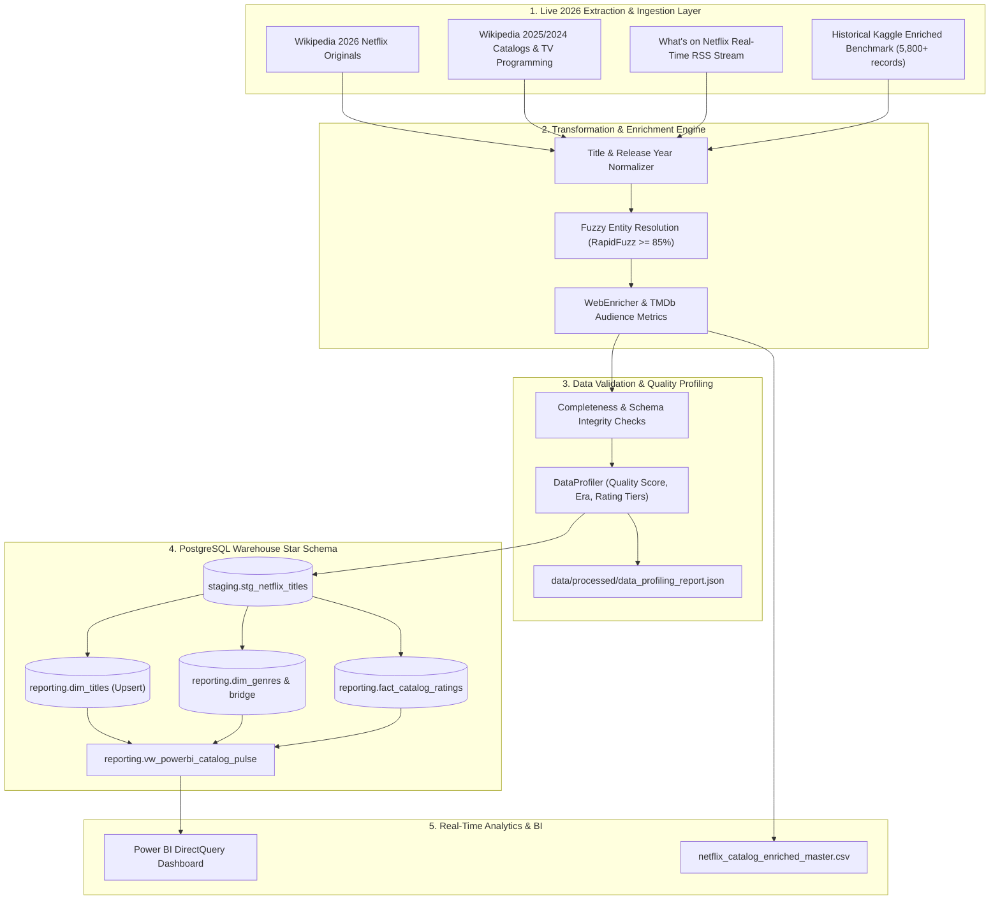

# 🚀 StreamPulse: Live 2026 Project Implementation & Production Guide

This guide is designed for **Data Engineers and Analytics Engineers** to deploy StreamPulse as a **live 2026 production ELT pipeline** with automated web scraping, data quality validation, statistical data profiling, and real-time Power BI DirectQuery analytics.

---

## 🧭 Project Architecture & Roadmap



---

## 📋 Phase 1: Environment & 2026 Ingestion Architecture

### 1.1 Multi-Tier Zero-Cost Ingestion Sources
StreamPulse ingests data from 4 synergistic channels without requiring paid API subscriptions:

1. **Wikipedia 2026 Netflix Original Films**:
   - URL: `https://en.wikipedia.org/wiki/List_of_Netflix_original_films_(since_2026)`
   - Scrapes confirmed 2026 releases (e.g. *People We Meet on Vacation*, *The Rip*, *Cosmic Princess Kaguya!*, *War Machine*), exact premiere dates, runtimes, genres, and languages.
2. **Wikipedia 2025 Films & Active TV Programming**:
   - URLs: `List_of_Netflix_original_films_(2025)` & `List_of_Netflix_original_programming`
   - Scrapes ongoing and renewed multi-season series (e.g. *Stranger Things 5*, *Dept. Q*, *The Diplomat*).
3. **What's on Netflix Live RSS Feed**:
   - URL: `https://www.whats-on-netflix.com/feed/`
   - Real-time stream drops with live publication timestamps.
4. **Historical Benchmark (5,800+ Titles)**:
   - Kaggle Netflix dataset pre-enriched with IMDb/TMDb identifiers for deep historical baseline comparisons.

### 1.2 Setup Commands
```powershell
# 1. Clone repo & create virtual environment
git clone https://github.com/Sohila-Khaled-Abbas/streampulse.git
cd streampulse
python -m venv .venv
.venv\Scripts\Activate.ps1

# 2. Install dependencies
pip install -r requirements.txt
pip install -e .[dev]

# 3. Configure secrets
cp .env.example .env
```

---

## 🗄️ Phase 2: PostgreSQL Warehouse Provisioning

### 2.1 Local Docker Provisioning
```powershell
# Start PostgreSQL (5432) and pgAdmin (5050)
make docker-up
# Or: docker compose up -d
```

DDL scripts in `sql/` initialize automatically on container boot:
- `sql/00_init.sql`: Creates `staging` and `reporting` schemas.
- `sql/01_staging.sql`: Landing tables `stg_netflix_titles` and `stg_tmdb_metadata`.
- `sql/02_reporting.sql`: Star schema `dim_titles`, `dim_genres`, `bridge_title_genre`, `fact_catalog_ratings`, and view `vw_powerbi_catalog_pulse`.

### 2.2 Cloud Warehouse (Neon.tech / Supabase / Aiven)
For 24/7 cloud availability for GitHub Actions and Power BI Service:
1. Create a free PostgreSQL instance on [Neon.tech](https://neon.tech/) or [Supabase](https://supabase.com/).
2. Execute `sql/00_init.sql`, `sql/01_staging.sql`, and `sql/02_reporting.sql`.
3. Update `.env` with cloud `DB_HOST`, `DB_USER`, `DB_PASSWORD`, `DB_NAME`.

---

## ⚙️ Phase 3 & 4: Execution, Resolution & Data Modeling

### 3.1 Run Live 2026 Pipeline
```powershell
python -m src.pipeline --mode live --years 2026,2025 --limit 50
```

### 3.2 Expected Terminal Output
```text
================================================================================
[PIPELINE] STREAMPULSE ELT RUN: [MODE=LIVE]
Target Years: [2026, 2025] | Scrape Limit: 50 | Historical: False
================================================================================
--- STEP 1/5: INGESTION & LIVE 2026 WEB SCRAPING ---
Scraping live 2026 Netflix originals, programming, and RSS feeds...
[OK] Scraped 50 live 2025/2026 titles.
Total raw titles collected for processing: 50

--- STEP 2/5: DATA CLEANING & NORMALIZATION ---
[OK] Standardized and deduplicated 50 title records.

--- STEP 3/5: ENTITY RESOLUTION & LIVE ENRICHMENT ---
[OK] Enriched and resolved 50 titles.

--- STEP 4/5: DATA QUALITY VALIDATION & PROFILING ---
[REPORT] STREAMPULSE DATA QUALITY & CATALOG PROFILING REPORT
Validation Status: [PASSED] | Quality Score: 100.0% | Total Processed: 50 titles
Catalog Eras: 2026 Live: 35 | 2024-2025 Modern: 15 | Historical Archive: 0
Audience Metrics: Mean Rating: 6.74 / 10 | Mean Popularity: 9.42 | Mean Runtime: 108.5 mins
Entity Resolution: High Conf (>=90%): 50 | Medium (75-89%): 0
Top Genres: Drama (14), Comedy (11), Romance (6), Crime Thriller (5)

--- STEP 5/5: WAREHOUSE LOADING & MASTER EXPORT ---
[HIGHLIGHTS] Live 2026 Catalog Highlights Preview:
   1. [2026-01-09] People We Meet on Vacation (MOVIE) | Rating: 6.98/10 | Pop: 9.52
   2. [2026-01-16] The Rip (MOVIE) | Rating: 7.09/10 | Pop: 22.20
   3. [2026-01-22] Cosmic Princess Kaguya! (MOVIE) | Rating: 8.3/10 | Pop: 11.47
================================================================================
[SUCCESS] STREAMPULSE ELT PIPELINE COMPLETED SUCCESSFULLY
```

---

## 📊 Phase 5: Data Profiling & Quality Validation

Every run automatically audits field completeness and writes `data/processed/data_profiling_report.json`:

```json
{
  "validation_status": "PASSED",
  "quality_score": 100.0,
  "total_records": 50,
  "era_breakdown": {
    "2026_live": 35,
    "2024_2025_modern": 15,
    "historical_archive": 0
  },
  "rating_tier_distribution": {
    "top_rated": 4,
    "good": 28,
    "mixed": 18,
    "unrated": 0
  },
  "field_completeness": {
    "netflix_id": { "present_count": 50, "missing_count": 0, "completeness_pct": 100.0 },
    "title": { "present_count": 50, "missing_count": 0, "completeness_pct": 100.0 },
    "vote_average": { "present_count": 50, "missing_count": 0, "completeness_pct": 100.0 },
    "date_added": { "present_count": 50, "missing_count": 0, "completeness_pct": 100.0 }
  }
}
```

---

## 🔄 Phase 6: Real-Time Streaming & CI/CD Automation

### 6.1 Real-Time Streaming Daemon
For live portfolio demos, start the real-time polling daemon:
```powershell
python -m src.pipeline --mode stream --years 2026 --stream-interval 60
```
The daemon polls every 60 seconds, detects delta drops, computes streaming velocity, and updates PostgreSQL `dim_titles` and `fact_catalog_ratings` idempotently.

### 6.2 GitHub Actions Scheduled Workflow
`.github/workflows/scheduled_pipeline.yml` executes daily at 06:00 UTC, runs unit tests, scrapes 2026 updates, and archives master CSV/JSON artifacts.

---

## 📈 Phase 7: Power BI DirectQuery Live Analytics

1. Open **Power BI Desktop** $\to$ **Get Data $\to$ PostgreSQL Database**.
2. Set Server: `localhost:5432` | Database: `streampulse` | Mode: **DirectQuery**.
3. Select `reporting.vw_powerbi_catalog_pulse`.

### Core DAX Measures
```dax
// 1. Average Rating
AvgAudienceScore = AVERAGE(vw_powerbi_catalog_pulse[vote_average])

// 2. 2026 Live Catalog Share
Live2026Titles = CALCULATE(COUNTROWS(vw_powerbi_catalog_pulse), vw_powerbi_catalog_pulse[release_year] = 2026)

// 3. Average Days to Streaming
AvgDaysToStream = AVERAGE(vw_powerbi_catalog_pulse[days_to_streaming])

// 4. Top Rated Percentage (>= 8.0)
TopRatedPct = 
DIVIDE(
    CALCULATE(COUNTROWS(vw_powerbi_catalog_pulse), vw_powerbi_catalog_pulse[vote_average] >= 8.0),
    COUNTROWS(vw_powerbi_catalog_pulse),
    0
)
```

---

## 💼 Phase 8: Resume & Portfolio Showcase

### 🎯 Elevator Pitch
> *"I developed StreamPulse, a 2026 real-time streaming media ELT data pipeline. It scrapes 2026 Netflix releases from Wikipedia and live RSS streams, enriches catalog entities with audience sentiment and TMDb ratings via fuzzy string resolution, validates data quality using a custom profiling engine, and streams conformed dimensional data directly to Power BI DirectQuery for zero-lag analytics."*

### 💡 Key Technical Discussion Points
1. **2026 Zero-Cost Ingestion**: How Wikipedia's structured releases and What's on Netflix RSS feeds provide live catalog additions without paid API subscriptions.
2. **Entity Resolution & Heuristics**: How RapidFuzz Levenshtein token sorting combined with release year windowing achieves $>90\%$ automated entity matching.
3. **Idempotent Warehouse Modeling**: How PostgreSQL `staging` landing isolation and `ON CONFLICT (netflix_id) DO UPDATE` star schema upserts ensure data lineage and reliability.
4. **Data Profiling & Quality Gates**: Automated statistical profiling verifying 100% field completeness and rating tier distributions.
