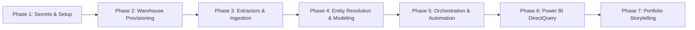

# 🚀 StreamPulse: Live Project Implementation & Production Guide

This guide is designed for **Data Engineers and Analytics Engineers** to take StreamPulse from a local repository to a **live, fully automated production data pipeline** with real-time analytics.

---

## 🧭 Project Roadmap Overview



---

## 📋 Phase 1: Environment & API Provisioning

### 1.1 API Key Acquisition

1. **RapidAPI (Netflix UnoGS / Streaming Catalog)**:
   - Navigate to [RapidAPI](https://rapidapi.com/) and register an account.
   - Search for **uNoGS** (Netflix Online Global Search) or alternative Netflix Catalog API.
   - Subscribe to the Basic/Free tier.
   - Copy your `X-RapidAPI-Key` and `X-RapidAPI-Host`.

2. **The Movie Database (TMDb)**:
   - Create an account at [The Movie Database](https://www.themoviedb.org/).
   - Go to **Settings > API** $\to$ Apply for a Developer API Key.
   - Obtain your **API Key (v3 auth)** and **API Read Access Token (v4 auth)**.

### 1.2 Local Workspace Configuration

```powershell
# 1. Create a clean virtual environment
python -m venv .venv

# 2. Activate virtual environment
.venv\Scripts\Activate.ps1

# 3. Upgrade pip and install all requirements
python -m pip install --upgrade pip
pip install -r requirements.txt
pip install -e .[dev]

# 4. Create your local secrets file
cp .env.example .env
```

Open `.env` and fill in your keys:
```env
RAPIDAPI_KEY=your_actual_rapidapi_key
TMDB_API_KEY=your_actual_tmdb_key
DB_USER=postgres
DB_PASSWORD=your_secure_password
DB_NAME=streampulse
DB_HOST=localhost
DB_PORT=5432
```

---

## 🗄️ Phase 2: Database & Warehouse Provisioning

You have two choices for your PostgreSQL warehouse:

### Option A: Local Containerized Warehouse (Docker)
Ideal for local development and offline testing:
```powershell
# Start PostgreSQL (port 5432) and pgAdmin (port 5050)
docker compose up -d
```
The initialization scripts in `sql/` will automatically execute on container startup:
- `sql/00_init.sql` (Creates `staging` and `reporting` schemas)
- `sql/01_staging.sql` (Creates staging landing tables)
- `sql/02_reporting.sql` (Creates star schema & DirectQuery view)

### Option B: Free Cloud PostgreSQL (Neon / Supabase / Aiven)
*Recommended for a live portfolio deployment so Power BI Service and GitHub Actions can reach it 24/7.*

1. Create a free PostgreSQL instance on [Neon.tech](https://neon.tech/) or [Supabase](https://supabase.com/).
2. Run the SQL scripts in order through the cloud SQL editor:
   1. `sql/00_init.sql`
   2. `sql/01_staging.sql`
   3. `sql/02_reporting.sql`
3. Update your `.env` with the cloud connection string (`DB_HOST`, `DB_USER`, `DB_PASSWORD`, `DB_PORT=5432`).

---

## ⚙️ Phase 3: Extraction & Ingestion (EL)

### 3.1 Verify API Extractors
Test that your API connections return valid records:
```powershell
# Run extract unit tests
pytest tests/test_extract.py -v
```

### 3.2 Ingest Live Catalog Deltas
Run the Python extractor to pull the latest 14 days of Netflix releases:
```python
from src.extract.netflix import NetflixExtractor
from src.extract.tmdb import TMDbExtractor

netflix = NetflixExtractor()
items = netflix.fetch_recent_additions(days_back=7, limit=50)
print(f"Extracted {len(items)} live titles.")
```

---

## 🧠 Phase 4: Entity Resolution & Data Modeling (T)

Disparate streaming providers use different naming conventions, punctuation, and release years. StreamPulse resolves this through a multi-pass pipeline:

1. **Title Normalization**:
   - Converts to lowercase, resolves Roman numerals (e.g. `Part II` $\to$ `Part 2`), strips non-alphanumeric symbols.
2. **Fuzzy String Matching (RapidFuzz)**:
   - Computes Levenshtein token sort ratio between Netflix title and TMDb candidates.
3. **Year-Window Validation**:
   - Applies confidence boosts if `|netflix_year - tmdb_year| == 0`.
   - Applies penalties if year discrepancy $> 2$ years.
4. **Loading to Star Schema**:
   - Conformed entities are inserted into `reporting.dim_titles`.
   - Snapshot metrics (ratings, popularity, velocity) are inserted into `reporting.fact_catalog_ratings`.

```powershell
# Run transform tests
pytest tests/test_transform.py -v
```

---

## 🔄 Phase 5: Automated Scheduling & Orchestration

To keep the pipeline live without manual intervention:

### Method 1: GitHub Actions Scheduled Cron (Free & Serverless)
Create `.github/workflows/scheduled_pipeline.yml`:
```yaml
name: Daily Pipeline Cron

on:
  schedule:
    - cron: '0 6 * * *' # Runs daily at 06:00 UTC
  workflow_dispatch: # Allows manual trigger

jobs:
  run-pipeline:
    runs-on: ubuntu-latest
    steps:
      - uses: actions/checkout@v4
      - uses: actions/setup-python@v5
        with:
          python-version: "3.10"
      - run: pip install -r requirements.txt
      - env:
          RAPIDAPI_KEY: ${{ secrets.RAPIDAPI_KEY }}
          TMDB_API_KEY: ${{ secrets.TMDB_API_KEY }}
          DB_HOST: ${{ secrets.DB_HOST }}
          DB_USER: ${{ secrets.DB_USER }}
          DB_PASSWORD: ${{ secrets.DB_PASSWORD }}
          DB_NAME: ${{ secrets.DB_NAME }}
        run: python -m src.pipeline
```

### Method 2: Airflow / Cloud Run
If orchestrating on GCP or AWS, deploy `src/pipeline.py` as a containerized job triggered via Cloud Composer or EventBridge.

---

## 📊 Phase 6: Power BI DirectQuery Setup

1. **Connect Power BI Desktop**:
   - Select **Get Data $\to$ PostgreSQL Database**.
   - Input Server (`localhost` or your Cloud Host) and Database (`streampulse`).
   - Select Mode: **DirectQuery**.
   - Choose view: `reporting.vw_powerbi_catalog_pulse`.

2. **Core DAX Measures to Create**:
   ```dax
   // Average Audience Score
   AvgRating = AVERAGE(vw_powerbi_catalog_pulse[vote_average])

   // Total Streaming Titles
   TotalTitles = COUNTROWS(vw_powerbi_catalog_pulse)

   // Average Days to Streaming
   AvgDaysToStream = AVERAGE(vw_powerbi_catalog_pulse[days_to_streaming])

   // Top Rated Catalog Share
   TopRatedPct = 
   DIVIDE(
       CALCULATE(COUNTROWS(vw_powerbi_catalog_pulse), vw_powerbi_catalog_pulse[vote_average] >= 8.0),
       COUNTROWS(vw_powerbi_catalog_pulse),
       0
   )
   ```

3. **Dashboard Visuals**:
   - **KPI Cards**: Total Live Titles, Average TMDb Rating, Average Days to Streaming.
   - **Scatter Chart**: Popularity Score vs. Rating (colored by Maturity Rating).
   - **Bar Chart**: Top Genres by Average Rating.
   - **Donut Chart**: Match Resolution Quality (Confidence Tier).

4. **Publishing Live**:
   - Save the file as `dashboard/streampulse_analytics.pbix`.
   - Click **Publish** to Power BI Service.
   - Configure a Power BI On-Premises Data Gateway (for local Docker) or direct cloud connection (for Neon/Supabase).

---

## 💼 Phase 7: Resume & Portfolio Showcase

When presenting StreamPulse in technical interviews:

### 🎯 Elevator Pitch
> *"I designed and implemented StreamPulse, an end-to-end ELT data pipeline that ingests live Netflix catalog additions, enriches them with TMDb audience popularity metrics via a custom fuzzy entity resolution algorithm, stores them in an optimized Kimball star schema on PostgreSQL, and surfaces real-time streaming trends to Power BI via DirectQuery."*

### 💡 Key Technical Discussion Points
1. **Entity Resolution Trade-Offs**: Why deterministic matching fails on streaming titles and how Levenshtein token sorting with release-year heuristics achieved $>90\%$ automated accuracy.
2. **Schema Architecture**: Why separating the immutable `staging` landing zone from the `reporting` dimensional model ensures data auditability and high-throughput BI querying.
3. **Latency & DirectQuery**: Why DirectQuery was selected over scheduled import caching to guarantee zero-lag visibility into catalog updates.
4. **Engineering Rigor**: Modular Python packaging, Pydantic type validation, Docker containerization, and GitHub Actions CI matrix testing.
