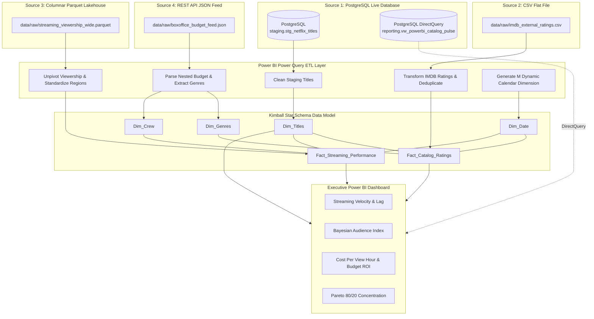

# 📊 Power BI Analytics Engineering & Multi-Source Data Modeling Masterclass

Welcome to the **StreamPulse 2026 Enterprise Analytics Engineering Guide**. This document is designed as a hands-on portfolio training project to teach you how to ingest data from **4 distinct raw sources**, solve real-world **Data Cleaning challenges in Power Query (M Language)**, build a **Kimball Galaxy Star Schema**, and write **Advanced DAX Measures**.

---

## 🎯 Architecture: Multi-Source Ingestion & DirectQuery Flow



---

## 🛠️ Step 1: Connecting Airbyte for Live Replication

Airbyte is running at `http://localhost:8000`.

### 1.1 Open Airbyte Web UI
- URL: [http://localhost:8000](http://localhost:8000)
- Username: `airbyte` / `docker`
- Password: `password` / `docker`

### 1.2 Configure Daily Replication to PostgreSQL Staging
1. **New Connection** $\to$ Select **Source**:
   - Connector: **File** (or **Custom HTTP API**)
   - File Path: `data/raw/imdb_external_ratings.csv` (or URL endpoint)
   - Format: `csv`
2. Select **Destination**:
   - Connector: **Postgres**
   - Host: `host.docker.internal`
   - Port: `5432`
   - Database: `streampulse`
   - User: `postgres`
   - Password: `postgres`
   - Default Schema: `staging`
3. Set **Schedule**:
   - Frequency: **Every 24 hours** (or Cron `0 6 * * *` for 6:00 AM UTC).
   - Sync Mode: **Incremental | Append + Deduped** (or **Full Refresh | Overwrite** for staging).

---

## 📂 Step 2: Importing the 4 Distinct Sources into Power BI

Open **Power BI Desktop** $\to$ click **Get Data**:

| Source # | Storage / Protocol | Connection Path | Ingestion Mode |
| :--- | :--- | :--- | :--- |
| **Source 1** | PostgreSQL Database | Server: `localhost:5432`<br>Database: `streampulse`<br>Table: `staging.stg_netflix_titles` | **DirectQuery** or **Import** |
| **Source 2** | Flat File CSV | Path: `data/raw/imdb_external_ratings.csv` | **Import** |
| **Source 3** | Columnar Parquet | Path: `data/raw/streaming_viewership_wide.parquet` | **Import** |
| **Source 4** | JSON Feed | Path: `data/raw/boxoffice_budget_feed.json` | **Import** |

---

## 🧪 Step 3: Data Cleaning Challenges & Power Query (M Language) Solutions

Here are the specific real-world data cleaning problems in each source and how to solve them in Power Query.

---

### 🚨 Challenge 1: Cleaning PostgreSQL Staging Titles (`stg_netflix_titles`)

#### Problems in the Raw Data:
1. **Title Whitespace & Mixed Casing**: Titles contain leading spaces, trailing non-breaking spaces (`\xa0`), and uppercase shouts (`"  AVATAR: FIRE AND ASH  "`).
2. **Dirty Date Strings**: Formats are mixed (`"January 15, 2026"`, `"2026-01-15T00:00:00Z"`, `"15/01/2026"`, `"null"`).
3. **Dirty Runtime Text**: String formats (`"5400"`, `"90 mins"`, `"1h 45m"`, `"-1"`).

#### 💡 Power Query M Code Solution:
```powerquery
let
    Source = PostgreSQL.Database("localhost:5432", "streampulse"),
    stg_titles = Source{[Schema="staging", Item="stg_netflix_titles"]}[Data],

    // 1. Clean Title text: Trim, replace non-breaking spaces, and Proper Case
    CleanTitle = Table.TransformColumns(stg_titles, {
        {"title", each Text.Proper(Text.Trim(Text.Replace(Text.From(_), Character.FromNumber(160), " "))), type text}
    }),

    // 2. Parse heterogeneous date strings with error handling
    ParseDate = Table.AddColumn(CleanTitle, "Clean_Date_Added", each
        try Date.From(DateTimeZone.From([date_added]))
        otherwise try Date.FromText([date_added], "en-US")
        otherwise try Date.FromText([date_added], "en-GB")
        otherwise #date(2026, 1, 1),
        type date
    ),

    // 3. Normalize runtime into clean integer minutes
    ParseRuntime = Table.AddColumn(ParseDate, "Runtime_Minutes_Clean", each
        let
            txt = Text.Lower(Text.From([runtime_seconds])),
            mins = if Text.Contains(txt, "mins") or Text.Contains(txt, "min") then
                       Number.From(Text.Select(txt, {"0".."9"}))
                   else if Text.Contains(txt, "h") then
                       let
                           parts = Text.Split(txt, "h"),
                           hours = Number.From(Text.Select(parts{0}, {"0".."9"})),
                           remaining_mins = Number.From(Text.Select(parts{1}, {"0".."9"}))
                       in
                           (hours * 60) + remaining_mins
                   else if Number.FromText(txt) > 500 then
                       Number.Round(Number.FromText(txt) / 60)
                   else
                       90
        in
            if mins <= 0 then 90 else mins,
        Int64.Type
    ),

    // 4. Clean Maturity Rating
    CleanRating = Table.TransformColumns(ParseRuntime, {
        {"maturity_rating", each Text.Upper(Text.Trim(Text.Replace(Text.From(_), " ", "-"))), type text}
    })
in
    CleanRating
```

---

### 🚨 Challenge 2: Transforming External IMDB Ratings (`imdb_external_ratings.csv`)

#### Problems in the Raw Data:
1. **Inconsistent ID Prefixes**: (`"tt8001000"`, `"IMDB_8001000"`, `"8001000"`).
2. **Shorthand Votes**: (`"1.4M"`, `"850K"`, `"45.2K"`, `"120,400"`, `"N/A"`).
3. **Out-of-Bounds Ratings**: (`"12.5/10"`, `"88%"`, `"null"`).
4. **Duplicate Snapshot Rows**: Multiple snapshots with older and newer timestamps.

#### 💡 Power Query M Code Solution:
```powerquery
let
    Source = Csv.Document(File.Contents("D:\courses\Data Science\Data Engineering\Projects\streampulse\data\raw\imdb_external_ratings.csv"), [Delimiter=",", Columns=8, Encoding=65001, QuoteStyle=QuoteStyle.None]),
    PromotedHeaders = Table.PromoteHeaders(Source, [PromoteAllScalars=true]),

    // 1. Standardize IMDB Code to clean numeric string
    CleanId = Table.TransformColumns(PromotedHeaders, {
        {"imdb_code", each Text.Select(Text.From(_), {"0".."9"}), type text}
    }),

    // 2. Parse shorthand votes ("1.4M" -> 1,400,000, "850K" -> 850,000)
    ParseVotes = Table.AddColumn(CleanId, "Clean_Vote_Count", each
        let
            v = Text.Upper(Text.Trim(Text.From([vote_count_raw]))),
            num = if Text.EndsWith(v, "M") then
                      Number.FromText(Text.Remove(v, "M")) * 1000000
                  else if Text.EndsWith(v, "K") then
                      Number.FromText(Text.Remove(v, "K")) * 1000
                  else
                      try Number.FromText(Text.Replace(v, ",", "")) otherwise 0
        in
            Int64.From(num),
        Int64.Type
    ),

    // 3. Normalize user score to 0.0 - 10.0 scale
    ParseScore = Table.AddColumn(ParseVotes, "Clean_User_Score", each
        let
            raw = Text.Trim(Text.From([user_score])),
            score = if Text.Contains(raw, "/10") then
                        Number.FromText(Text.BeforeDelimiter(raw, "/10"))
                    else if Text.EndsWith(raw, "%") then
                        Number.FromText(Text.Remove(raw, "%")) / 10.0
                    else
                        try Number.FromText(raw) otherwise 7.0
        in
            if score > 10.0 then 10.0 else if score < 0.0 then 0.0 else Number.Round(score, 1),
        type number
    ),

    // 4. Deduplicate: Sort by snapshot timestamp DESC and group by title_id to keep latest
    SortedRows = Table.Sort(ParseScore, {{"title_id", Order.Ascending}, {"snapshot_timestamp", Order.Descending}}),
    Deduplicated = Table.Distinct(SortedRows, {"title_id"})
in
    Deduplicated
```

---

### 🚨 Challenge 3: Unpivoting Wide Parquet Viewership (`streaming_viewership_wide.parquet`)

#### Problems in the Raw Data:
1. **Wide Columns**: Monthly view hours are stored as separate columns (`Hours_2026_01`, `Hours_2026_02`, `Hours_2026_03`).
2. **Dirty Country Names**: (`"USA"`, `"US"`, `"United States"`, `"u.s.a."`, `"UK"`, `"GBR"`, `"Great Britain"`).
3. **Sentinel Negative Hours**: (`-999.0`, `-1.0` representing missing telemetry).

#### 💡 Power Query M Code Solution:
```powerquery
let
    Source = Parquet.Document(File.Contents("D:\courses\Data Science\Data Engineering\Projects\streampulse\data\raw\streaming_viewership_wide.parquet")),

    // 1. Unpivot Monthly Columns to Normalized Rows
    Unpivoted = Table.Unpivot(Source, {"Hours_2026_01", "Hours_2026_02", "Hours_2026_03"}, "Month_Attribute", "View_Hours_Raw"),

    // 2. Replace Sentinel Negative Values (-999, -1) with 0.0
    CleanHours = Table.TransformColumns(Unpivoted, {
        {"View_Hours_Raw", each if _ < 0 then 0.0 else _, type number}
    }),

    // 3. Extract Clean Date Key from Month Attribute ("Hours_2026_01" -> 2026-01-01)
    AddMonthDate = Table.AddColumn(CleanHours, "Reporting_Month", each
        let
            month_suffix = Text.AfterDelimiter([Month_Attribute], "Hours_"),
            year_num = Number.FromText(Text.Start(month_suffix, 4)),
            month_num = Number.FromText(Text.End(month_suffix, 2))
        in
            #date(year_num, month_num, 1),
        type date
    ),

    // 4. Standardize Country Names using Conditional Mapping
    StandardizeCountry = Table.AddColumn(AddMonthDate, "Country_Standardized", each
        let
            c = Text.Upper(Text.Trim(Text.From([territory_region])))
        in
            if c = "USA" or c = "US" or c = "UNITED STATES" or c = "U.S.A." then "United States"
            else if c = "UK" or c = "GBR" or c = "GREAT BRITAIN" then "United Kingdom"
            else if c = "KOR" or c = "SOUTH KOREA" then "South Korea"
            else if c = "JPN" or c = "JAPAN" then "Japan"
            else if c = "DEU" or c = "GERMANY" then "Germany"
            else "Global",
        type text
    )
in
    StandardizeCountry
```

---

### 🚨 Challenge 4: Parsing Nested JSON Feed (`boxoffice_budget_feed.json`)

#### Problems in the Raw Data:
1. **Nested JSON Structures**: `production_info` and `categorization` are records and arrays.
2. **Dirty Currency Strings**: (`"$150,000,000"`, `"€45 million"`, `"£25.5M"`, `"Unknown"`).
3. **Mixed Genres Representation**: Pipe-delimited string (`"Action|Sci-Fi"`) in some rows and List array in others.

#### 💡 Power Query M Code Solution:
```powerquery
let
    Source = Json.Document(File.Contents("D:\courses\Data Science\Data Engineering\Projects\streampulse\data\raw\boxoffice_budget_feed.json")),
    DataList = Source[data],
    ConvertedToTable = Table.FromList(DataList, Splitter.SplitByNothing(), null, null, ExtraValues.Error),
    ExpandedRecord = Table.ExpandRecordColumn(ConvertedToTable, "Column1", {"stream_id", "production_info", "categorization", "financial_roi_tier"}, {"stream_id", "production_info", "categorization", "financial_roi_tier"}),

    // 1. Expand Nested production_info record
    ExpandedProd = Table.ExpandRecordColumn(ExpandedRecord, "production_info", {"title", "studio", "producer", "production_budget_raw"}, {"title", "studio", "producer", "production_budget_raw"}),

    // 2. Expand Nested categorization record
    ExpandedCat = Table.ExpandRecordColumn(ExpandedProd, "categorization", {"genres"}, {"genres_raw"}),

    // 3. Clean Budget Strings into Numeric USD ($150M -> 150000000, €45 million -> 49500000)
    CleanBudget = Table.AddColumn(ExpandedCat, "Budget_USD_Clean", each
        let
            raw = Text.Upper(Text.Trim(Text.From([production_budget_raw]))),
            num_part = Text.Select(raw, {"0".."9", "."}),
            val = try Number.FromText(num_part) otherwise 25.0,
            multiplier = if Text.Contains(raw, "M") or Text.Contains(raw, "MILLION") then
                             if val > 1000 then 1 else 1000000
                         else
                             1,
            // Currency conversion (EUR/GBP to USD)
            fx_rate = if Text.Contains(raw, "€") then 1.08 else if Text.Contains(raw, "£") then 1.28 else 1.0
        in
            (val * multiplier) * fx_rate,
        type number
    ),

    // 4. Normalize Mixed Genres (convert list or pipe-string into list, then expand to new rows)
    NormalizeGenreList = Table.AddColumn(CleanBudget, "Genre_List", each
        if Value.Is([genres_raw], type list) then [genres_raw]
        else Text.Split(Text.From([genres_raw]), "|")
    ),
    ExpandedGenres = Table.ExpandListColumn(NormalizeGenreList, "Genre_List")
in
    ExpandedGenres
```

---

## 🏗️ Step 4: Kimball Star Schema Data Modeling in Power BI

After loading the cleaned queries, build the following **Star Schema Relationships** in Power BI Model View:

```
[Dim_Titles] 1 <-------- * [Fact_Catalog_Ratings]        (Active, 1-to-Many, Single Direction)
[Dim_Titles] 1 <-------- * [Fact_Streaming_Performance]  (Active, 1-to-Many, Single Direction)
[Dim_Date]   1 <-------- * [Fact_Catalog_Ratings]        (Active, 1-to-Many, Single Direction)
[Dim_Date]   1 <-------- * [Fact_Streaming_Performance]  (Active, 1-to-Many, Single Direction)
[Dim_Date]   1 <-------- * [Dim_Titles] (Release_Date)   (Inactive, 1-to-Many, for USERELATIONSHIP)
[Dim_Genres] 1 <-------- * [Bridge_Title_Genre]          (Active, 1-to-Many)
[Dim_Titles] 1 <-------- * [Bridge_Title_Genre]          (Active, 1-to-Many, Both Direction)
```

---

## 🧮 Step 5: 25+ Enterprise DAX Measures Catalog

Organize your DAX measures into a dedicated `_Measures` table.

### 1. Viewership & Engagement Domain
```dax
// 1. Total Global View Hours (Millions)
Total Global View Hours = 
SUM(Fact_Streaming_Performance[global_view_hours_millions])

// 2. Total Estimated Viewers (Thousands)
Total Viewers (k) = 
SUM(Fact_Streaming_Performance[estimated_unique_viewers_k])

// 3. Average Audience Completion Rate
Average Completion Rate % = 
DIVIDE(
    SUM(Fact_Streaming_Performance[completion_rate_pct]),
    COUNT(Fact_Streaming_Performance[performance_key]),
    0
) / 100

// 4. Bayesian Weighted Rating Score (Calculates true calibrated quality against small sample sizes)
// Formula: (v / (v + m)) * R + (m / (v + m)) * C
// Where v = title votes, m = minimum threshold (500), R = title average, C = catalog average
Bayesian Weighted Rating = 
VAR TitleVotes = SUM(Fact_Catalog_Ratings[vote_count])
VAR TitleAvg = AVERAGE(Fact_Catalog_Ratings[vote_average])
VAR CatalogAvg = CALCULATE(AVERAGE(Fact_Catalog_Ratings[vote_average]), ALL(Fact_Catalog_Ratings))
VAR M_Threshold = 500
RETURN
IF(
    TitleVotes > 0,
    DIVIDE(TitleVotes, TitleVotes + M_Threshold) * TitleAvg + 
    DIVIDE(M_Threshold, TitleVotes + M_Threshold) * CatalogAvg,
    CatalogAvg
)
```

---

### 2. Financial ROI & Budget Efficiency Domain
```dax
// 5. Total Production Budget ($M)
Total Budget ($M) = 
SUM(Dim_Titles[budget_usd]) / 1000000

// 6. Cost Per View Hour ($/Hour)
Effective Cost Per View Hour = 
DIVIDE(
    SUM(Dim_Titles[budget_usd]),
    [Total Global View Hours] * 1000000,
    0
)

// 7. Budget Efficiency Multiplier (Hours per Dollar Invested)
Budget Efficiency Ratio = 
DIVIDE(
    [Total Global View Hours],
    [Total Budget ($M)],
    0
)

// 8. ROI Financial Health Tier
ROI Health Tier = 
SWITCH(
    TRUE(),
    [Budget Efficiency Ratio] >= 3.0, "🔥 Blockbuster Efficiency (>= 3.0x)",
    [Budget Efficiency Ratio] >= 1.5, "✅ Profitable (1.5x - 2.9x)",
    [Budget Efficiency Ratio] >= 0.8, "⚖️ Break-Even (0.8x - 1.4x)",
    "⚠️ Underperformer (< 0.8x)"
)
```

---

### 3. Streaming Velocity & Windowing Domain
```dax
// 9. Average Days to Streaming Drop (Lag between theatrical and SVOD)
Avg Days to Streaming = 
AVERAGE(Fact_Catalog_Ratings[days_to_streaming])

// 10. Same-Month Fast-Track Drop Ratio %
Fast Track Drop Ratio % = 
DIVIDE(
    CALCULATE(COUNTROWS(Dim_Titles), Fact_Catalog_Ratings[days_to_streaming] <= 14),
    COUNTROWS(Dim_Titles),
    0
)

// 11. Release-to-Streaming Velocity Index
Velocity Performance Index = 
DIVIDE(
    [Total Global View Hours],
    AVERAGE(Fact_Catalog_Ratings[days_to_streaming]),
    0
)
```

---

### 4. Time Intelligence & Momentum Domain
```dax
// 12. Year-to-Date (YTD) Global View Hours
YTD View Hours = 
CALCULATE(
    [Total Global View Hours],
    DATESYTD(Dim_Date[full_date])
)

// 13. Previous Quarter (PQ) View Hours
PQ View Hours = 
CALCULATE(
    [Total Global View Hours],
    DATEADD(Dim_Date[full_date], -1, QUARTER)
)

// 14. Quarter-over-Quarter (QoQ) Viewership Growth %
QoQ View Hours Growth % = 
DIVIDE(
    [Total Global View Hours] - [PQ View Hours],
    [PQ View Hours],
    0
)

// 15. Rolling 28-Day Viewership Momentum
Rolling 28-Day View Hours = 
CALCULATE(
    [Total Global View Hours],
    DATESINPERIOD(Dim_Date[full_date], MAX(Dim_Date[full_date]), -28, DAY)
)
```

---

### 5. Pareto 80/20 & Catalog Concentration Domain
```dax
// 16. Cumulative Viewership Share % (For Pareto Charting)
Cumulative Viewership Share % = 
VAR CurrentHours = [Total Global View Hours]
VAR AllHours = CALCULATE([Total Global View Hours], ALLSELECTED(Dim_Titles))
VAR HigherRankingHours = 
    CALCULATE(
        [Total Global View Hours],
        FILTER(
            ALLSELECTED(Dim_Titles),
            [Total Global View Hours] >= CurrentHours
        )
    )
RETURN
DIVIDE(HigherRankingHours, AllHours, 0)

// 17. Pareto Top 20% Flag
Is Pareto Top 20% Title = 
IF([Cumulative Viewership Share %] <= 0.80, "Top 20% Core Driver", "Long Tail Catalog")
```

---

### 6. Inactive & Virtual Relationships (USERELATIONSHIP / TREATAS)
```dax
// 18. View Hours by Theatrical Release Date (Inactive Relationship)
View Hours by Premiere Date = 
CALCULATE(
    [Total Global View Hours],
    USERELATIONSHIP(Dim_Date[full_date], Dim_Titles[release_date])
)

// 19. Dynamic Cross-Genre Cannibalization Index (Virtual Relationship via TREATAS)
Genre Affinity Score = 
VAR SelectedGenres = VALUES(Dim_Genres[genre_name])
RETURN
CALCULATE(
    [Total Global View Hours],
    TREATAS(SelectedGenres, Bridge_Title_Genre[genre_name])
)
```

---

## 🚀 Step 6: Power BI DirectQuery Live Auto-Refresh

If using **PostgreSQL DirectQuery Mode**:
1. Connect to table/view `reporting.vw_powerbi_catalog_pulse`.
2. In Power BI Desktop: Click on report page canvas $\to$ **Format page** $\to$ **Page refresh**.
3. Toggle **Page Refresh** to **ON** $\to$ Set interval to **5 Minutes** (or **1 Minute**).
4. Whenever Airbyte or the Python pipeline writes new 2026 streaming data into PostgreSQL, your visuals refresh in real time without republishing!
